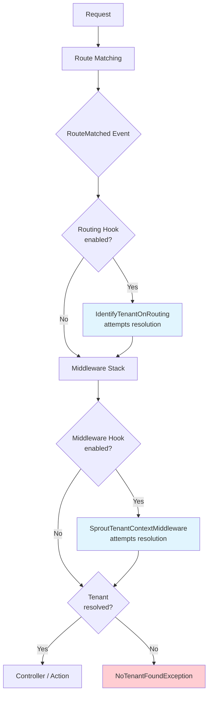

# Resolution Hooks

Resolution hooks define the points in Laravel's request lifecycle where tenant identification can occur. Each hook
represents a specific moment when Sprout can attempt to resolve the current tenant.

## Overview

Sprout supports multiple resolution hooks to accommodate different identification strategies. Some strategies (like
subdomain or path) can resolve very early, while others (like session) require Laravel services that aren't available
until later in the lifecycle.



**Hook timing:**

- **Routing Hook** — Route and parameters available. Best for most resolvers.
- **Middleware Hook** — Sessions and auth available. Required for session resolver. Enforces tenant requirement.

## Available Hooks

### Booting

```php
ResolutionHook::Booting
```

Occurs during the booting of service providers.

> **Note:** This hook exists in the enum but is not currently used anywhere in the framework. It's reserved for
> potential future use cases where tenant resolution needs to happen before routing.

### Routing

```php
ResolutionHook::Routing
```

Occurs when Laravel's `RouteMatched` event fires, immediately after the router has matched the request to a route.

**Implementation:** When this hook is enabled, `SproutServiceProvider` registers `IdentifyTenantOnRouting` as a listener
for the `RouteMatched` event. The listener checks if the matched route has Sprout's tenanted middleware (
`sprout.tenanted`), and if so, attempts resolution.

**When it fires:**

- After the router has matched the request to a route
- Before route middleware runs

**What's available:**

- The `Route` object and its parameters
- Request data (headers, cookies, path, host)
- Basic Laravel services (config, cache, etc.)

**What's NOT available:**

- Session data (session middleware hasn't run)
- Authenticated user (auth middleware hasn't run)
- Anything set by route middleware

**Best for:**

- Subdomain resolution
- Path resolution
- Header resolution
- Cookie resolution
- Domain resolution (Canopy)

This is the recommended hook for most applications because:

1. The tenant is available for dependency injection in middleware constructors
2. Service overrides can set up before other middleware runs
3. Session and auth middleware will have tenant context when they run

### Middleware

```php
ResolutionHook::Middleware
```

Occurs during the route middleware stack, as part of Sprout's `SproutTenantContextMiddleware`.

**When it fires:**

- During the middleware stack execution
- Position depends on middleware priority configuration

**What's available:**

- Everything from the Routing hook
- Session data (if session middleware has run first)
- Potentially the authenticated user (if auth middleware has run first)

**What's NOT available:**

- Depends on middleware ordering

**Best for:**

- Session resolution (requires session data)
- Any resolver that depends on middleware-provided data

**Tenant Enforcement:**

After the Middleware hook completes (whether resolution was attempted or not), `SproutTenantContextMiddleware` enforces
that a tenant exists. If no tenant has been resolved by any enabled hook, a `NoTenantFoundException` is thrown:

```php
if (! $this->sprout->hasCurrentTenancy() || ! $this->sprout->getCurrentTenancy()?->check()) {
    throw NoTenantFoundException::make($resolverName, $tenancyName);
}
```

This means the Middleware hook is effectively the "last chance" for tenant resolution on tenanted routes.

## Configuration

Hooks are enabled in the Sprout configuration:

```php
// config/sprout/core.php
'hooks' => [
    \Sprout\Core\Support\ResolutionHook::Routing,
    \Sprout\Core\Support\ResolutionHook::Middleware,
],
```

The order hooks appear in the configuration array does not matter — each hook fires at its predetermined point in the
lifecycle. The configuration simply controls which hooks are enabled.

**Default configuration:** Both `Routing` and `Middleware` are enabled by default, which covers most use cases.

## Implementation Classes

| Hook       | Triggered By         | Handler Class                   |
|------------|----------------------|---------------------------------|
| Routing    | `RouteMatched` event | `IdentifyTenantOnRouting`       |
| Middleware | Middleware execution | `SproutTenantContextMiddleware` |

### IdentifyTenantOnRouting

Registered as an event listener in `SproutServiceProvider`:

```php
if ($this->sprout->supportsHook(ResolutionHook::Routing)) {
    $events->listen(RouteMatched::class, IdentifyTenantOnRouting::class);
}
```

The listener:

1. Parses the route's middleware stack to find `sprout.tenanted` or `sprout.tenanted.optional`
2. Extracts resolver and tenancy names from middleware parameters
3. Calls `ResolutionHelper::handleResolution()` with `ResolutionHook::Routing`

### SproutTenantContextMiddleware

The middleware (aliased as `sprout.tenanted`):

1. Parses resolver and tenancy names from middleware parameters
2. If Middleware hook is enabled, calls `ResolutionHelper::handleResolution()`
3. **Enforces tenant requirement** — throws `NoTenantFoundException` if no tenant resolved

### SproutOptionalTenantContextMiddleware

An alternative middleware (aliased as `sprout.tenanted.optional`) that does not throw an exception if no tenant is
found. Useful for routes that can work both with and without a tenant context.

## How Resolution Works

Both hooks delegate to `ResolutionHelper::handleResolution()`, which orchestrates the resolution process:

```php
ResolutionHelper::handleResolution(
    $request,
    $hook,
    $sprout,
    $resolverName,
    $tenancyName
);
```

The resolution flow:

1. **Set current hook** — `$sprout->setCurrentHook($hook)` records which hook is being processed
2. **Get resolver and tenancy** — Retrieves the configured resolver and tenancy (or defaults)
3. **Check if resolution should proceed:**
    - If tenancy already has a tenant (`$tenancy->check()`), skip resolution
    - If resolver can't resolve at this hook (`!$resolver->canResolve(...)`), skip resolution
4. **Set current tenancy** — `$sprout->setCurrentTenancy($tenancy)`
5. **Resolve identity:**
    - If resolver uses parameters AND parameter exists in route → `$resolver->resolveFromRoute()`
    - Otherwise → `$resolver->resolveFromRequest()`
6. **Record resolution metadata** — `$tenancy->resolvedVia($resolver)->resolvedAt($hook)`
7. **Identify tenant** — `$tenancy->identify($identity)` loads the tenant via the provider

```php
// Resolver decides if it can work at this hook
public function canResolve(Request $request, Tenancy $tenancy, ResolutionHook $hook): bool
{
    // Session resolver can only work during Middleware hook
    if ($this->driver === 'session') {
        return $hook === ResolutionHook::Middleware;
    }
    
    return true;
}
```

### Parameter-Based Resolution

For resolvers that implement `IdentityResolverUsesParameters` (subdomain, path, domain), the resolution helper checks if
the route has the expected parameter:

```php
if (
    $resolver instanceof IdentityResolverUsesParameters
    && $route !== null
    && $route->hasParameter($resolver->getRouteParameterName($tenancy))
) {
    $identity = $resolver->resolveFromRoute($route, $tenancy, $request);
    $route->forgetParameter($resolver->getRouteParameterName($tenancy));
} else {
    $identity = $resolver->resolveFromRequest($request, $tenancy);
}
```

The parameter is removed from the route after resolution (`forgetParameter`) so it doesn't appear in controller method
signatures or route parameter arrays.

## Resolver Compatibility

Not all resolvers work at all hooks:

| Resolver        | Routing | Middleware | Notes                       |
|-----------------|---------|------------|-----------------------------|
| Subdomain       | ✓       | ✓          | Works at either             |
| Path            | ✓       | ✓          | Works at either             |
| Header          | ✓       | ✓          | Works at either             |
| Cookie          | ✓       | ✓          | Works at either             |
| Session         | ✗       | ✓          | Requires session middleware |
| Domain (Canopy) | ✓       | ✓          | Works at either             |

## Middleware Priority

When using the `Middleware` hook with the session resolver, you may need to adjust middleware priority to ensure
Sprout's middleware runs after `StartSession`:

```php
// bootstrap/app.php
return Application::configure(basePath: dirname(__DIR__))
    ->withMiddleware(function (Middleware $middleware) {
        $middleware->appendToPriorityList(
            \Illuminate\Session\Middleware\StartSession::class,
            \Sprout\Core\Http\Middleware\SproutTenantContextMiddleware::class
        );
    });
```

The middleware is also available via the alias `sprout.tenanted`.

> **Warning:** Only adjust middleware priority if you're using the session resolver. Changing priority when using other
> resolvers can cause issues with the session service override and other Sprout features.

## Tracking Resolution

The tenancy tracks where resolution occurred:

```php
// Get the hook where the tenant was resolved
$hook = $tenancy->hook(); // ResolutionHook::Routing

// Check if resolution happened
if ($tenancy->wasResolved()) {
    $resolver = $tenancy->resolver();
    $hook = $tenancy->hook();
}
```

Sprout also tracks the current hook during request processing:

```php
// During request lifecycle
$currentHook = sprout()->getCurrentHook();

// Check if we're at a specific hook
if (sprout()->isCurrentHook(ResolutionHook::Routing)) {
    // ...
}
```

## Common Patterns

### Standard Web Application

Most applications should use the default configuration:

```php
'hooks' => [
    ResolutionHook::Routing,
    ResolutionHook::Middleware,
],
```

With a resolver that works at `Routing` (subdomain, path, header, etc.), the tenant is resolved early and available
throughout the middleware stack.

### Session-Based Identification

For applications using session-based tenant identification:

```php
'hooks' => [
    ResolutionHook::Middleware,
],
```

Or keep both enabled — the session resolver will simply skip the `Routing` hook via its `canResolve()` method.

### API with Multiple Identification Methods

For APIs that accept tenant identification via header or cookie:

```php
'hooks' => [
    ResolutionHook::Routing,
],
```

The `Middleware` hook isn't needed since neither resolver requires session data.
